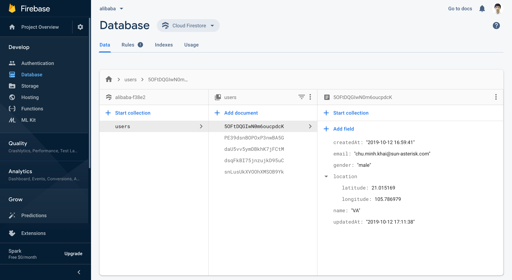

# Alibaba Server

Sun* Hackathon 2019

## Install

```bash
$ npm install -g yarn
$ yarn install
```
> Install all node modules

## Migrate

```bash
$ yarn command migrate
```
> Init and seed Firestore Database

## Develop

```bash
$ yarn develop
```
> Start development environment
> [Development URL](http://localhost:3000)

## Deploy

```bash
$ yarn deploy
```
> Deploy new github source code to production
> [Production URL](http://34.68.232.179)

## SSH

```bash
$ ssh -o "UserKnownHostsFile=/dev/null" -o "StrictHostKeyChecking no" -i credentials/ssh.private app@34.68.232.179
```
> Access to production server

## API

[](https://app.getpostman.com/run-collection/16ce7f0f7edaebdc76f0)
> API `endpoint`/`request method`/`request parameter`

## Database

- [Database Console](https://console.firebase.google.com/u/0/project/alibaba-f38e2/database/firestore/data~2F)


## Documents

- [PM2 Quick Start](http://pm2.keymetrics.io/docs/usage/quick-start/)
- [Cloud Firestore](https://firebase.google.com/docs/firestore)
- [Cloud Firestore: Node.js Client](https://googleapis.dev/nodejs/firestore/latest/)
- [Firestore Snippets Node.js](https://github.com/firebase/snippets-node/blob/master/firestore/main/index.js)
- [Send message to device](https://firebase.google.com/docs/cloud-messaging/send-message)

## Known issues

- Node.js process crashed and can not start server
  > `Internal watch failed: ENOSPC: System limit for number of file watchers reached`
  - Solution:
    ```bash
    echo fs.inotify.max_user_watches=524288 | sudo tee -a /etc/sysctl.conf && sudo sysctl -p
    ```
